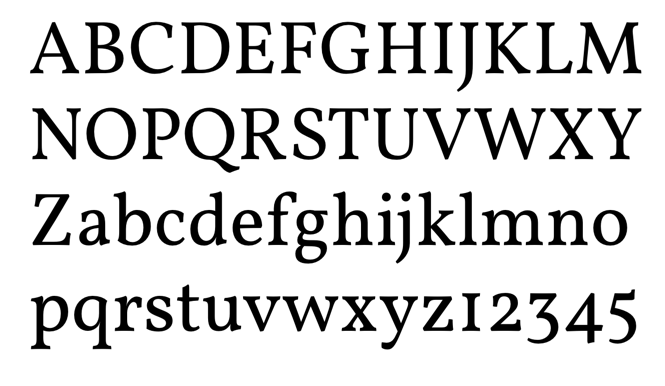

# Vollkorn-Typeface
Vollkorn Typeface by Friedrich Althausen ([friedrichalthausen.de/](1))

»Vollkorn« is the free and healthy typeface for bread and butter use.

Published under the SIL OFL license – free as always – pay what you want.

Project page: [vollkorn-typeface.com](2)

#### Specimen

#### Copyright

Copyright (c) 2005–2016, Friedrich Althausen (http://friedrichalthausen.de). All rights reserved.

#### License

This Font Software is licensed under the SIL Open Font License, Version 1.1.
This license is copied below, and is also available with a FAQ at:
http://scripts.sil.org/OFL

[1]:http://friedrichalthausen.de
[2]:http://www.vollkorn-typeface.com/
